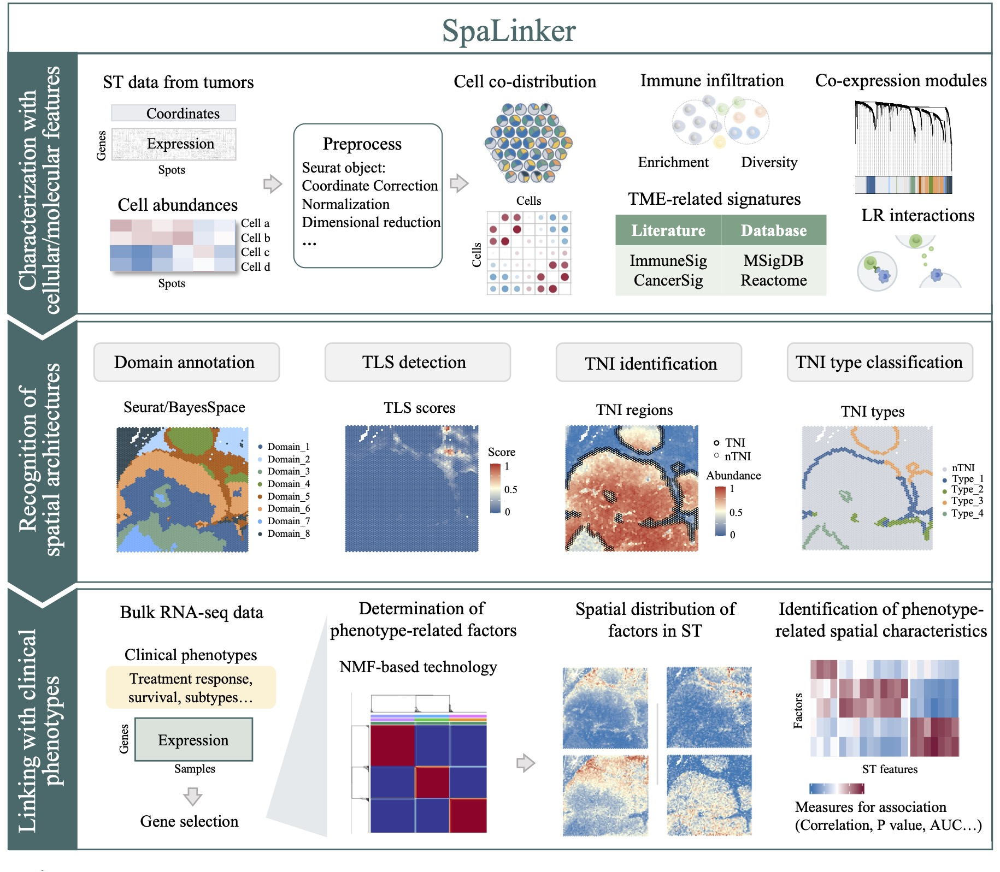

# SpaTME

## Overview


SpaTME is an integrative analytical framework designed for TME deciphering and phenotype linking using spot-resolution ST data. It consists of three functional parts (Figures 1): (1) Characterization of the TME with molecular and cellular features. (2) Recognition of spatial architectures. . (3) Linking with clinical phenotypes.

## Installation

SpaTME has been built and tested with R >= 4.3.2. Specific package dependencies are defined in the package DESCRIPTION.
```
# Install devtools, if necessary
if (!requireNamespace("devtools", quietly = TRUE))
    install.packages("devtools")

devtools::install_github("Chengxiaojie/SpaTME")
```

## Demonstration

For examples of typical SpaTME usage, please see our [package vignette](https://github.com/Chengxiaojie/SpaTME/blob/main/vignettes/SpaTME.pdf).

